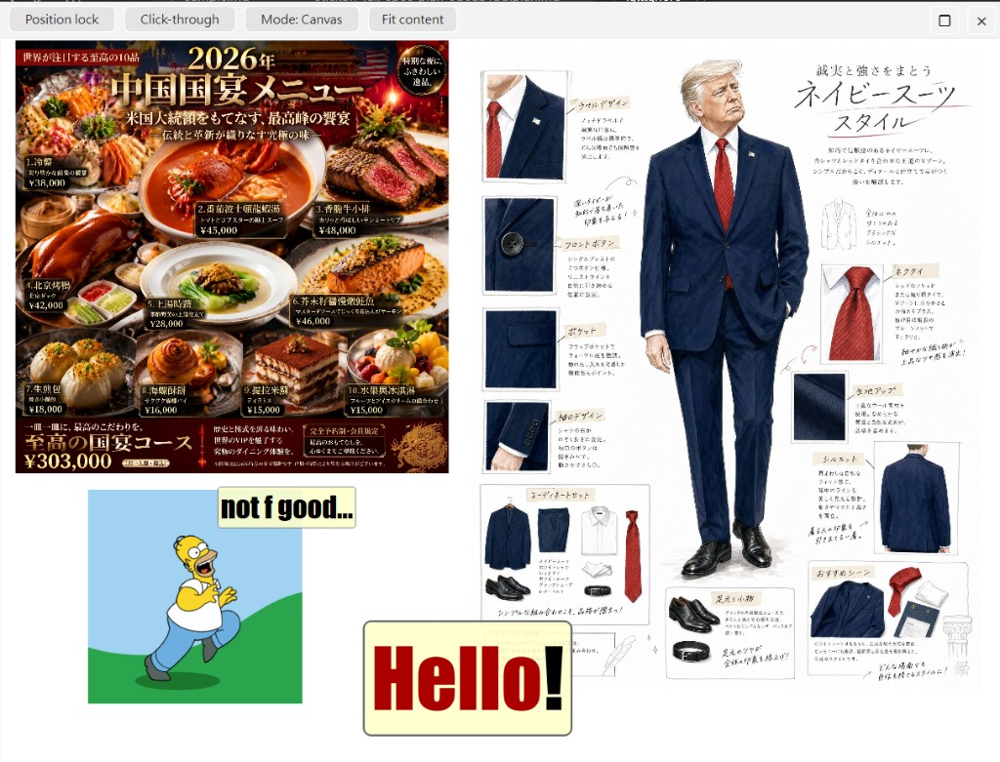

# StickOn

**StickOn** is a lightweight, Windows-first **desktop reference board**. Drop images onto a frameless canvas, arrange them like stickers on glass, add handwritten-style notes and quick sketches, then leave the window floating above your work—or let mouse events pass through when you only need the picture as a visual anchor.

Built with **PySide6 (Qt 6)** and installed as a small Python package so you can run it with **`uv`** without touching a global Python install.

---

## Preview



---

## Features

- **Images as first-class citizens** — Drag files from Explorer or paste from the clipboard (`Ctrl+V`: bitmap or a file path). GIFs animate; corner handles resize; crops, rotate, scale, and flip gestures stay on the canvas.
- **Notes** — Add notes with `Ctrl+N`, double-click empty canvas to place one under the pointer, or edit inline by double-clicking a note. Resize handles scale text with the card.
- **Layout helpers** — Pack images into the viewport, align selections, and group nodes when you need them to move together.
- **Window that behaves like a tool** — Always on top or bottom, adjustable opacity, optional **click-through** (`Ctrl+T`) so you can see through to apps underneath (Windows uses precise hit-testing so the title bar and resize rim stay clickable).
- **Session memory** — Closing saves layout: window position and size, zoom/view state when configured, and each node’s transforms. Reopening restores your last board (`StickOn — last session`).
- **Command palette** — `Ctrl+Shift+P` opens the command palette for discoverable actions and shortcuts.

Drawing mode, scene export, undo/redo, and GIF playback controls round out the workflow for quick visual references—not a full image editor, but a fast overlay for design, 3D, coding, or teaching side-by-side with another window.

---

## Setup

Use [uv](https://docs.astral.sh/uv/) and install dependencies (including dev tools like pytest):

```bash
uv sync --group dev
```

The project is installed in editable mode so imports like `stickon` work under **`uv run`**.

---

## Run

Prefer **`uv run`** so you use this repo’s virtual environment:

```bash
uv run stickon
```

or:

```bash
uv run python -m stickon.main
```

---

## Tests

```bash
uv run pytest
```

---

## Notes

- On first launch, StickOn shows a short click-through safety reminder (`Ctrl+T` / **Escape** to recover pointer hits).
- Clipboard paste: **`Ctrl+V`** (bitmap or image file path).
- Right-click the canvas for a compact menu (pack, alignment submenu, notes, draw mode, export, and more).
